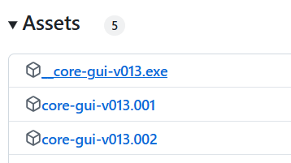
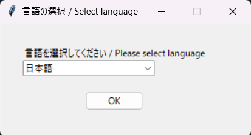
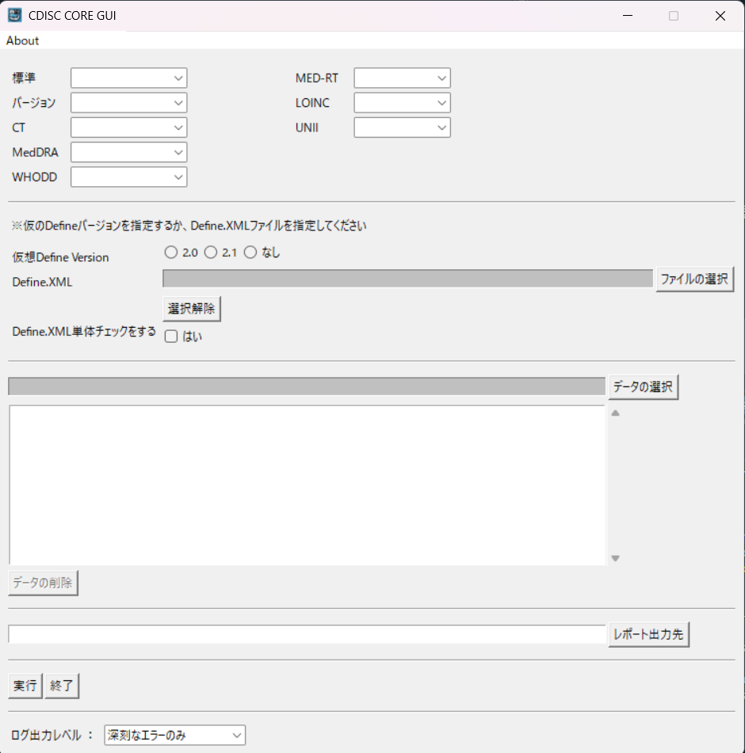
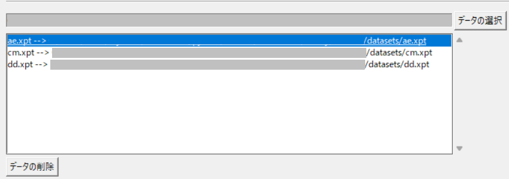

# CDISC-CORE-GUI

README in English [README.md](https://github.com/HajimeShimizu/CDISC-CORE-GUI/blob/main/README.md).

## 概要
CDISCは[CDISC Open Rules Engine (CORE)](https://github.com/cdisc-org/cdisc-rules-engine)を開発していますが、コマンドライン版のみが提供されています。CDISC CORE GUI は、COREにGUIを搭載したものです。本ツールは、ユーザーがテストしやすいCORE環境を用意し、CORE開発者へのフィードバック/PMDAルール開発を促すことを目的としています。

CDISC-CORE-GUIの最新バージョンでは、CORE v0.10.0をベースとしています、

## ダウンロード
[こちらのページ](https://github.com/HajimeShimizu/CDISC-CORE-GUI/releases)からダウンロードできます\

### 注意事項
1. 上記ファイルをすべてダウンロードします
2. exeファイルをダブルクリックすると、ファイルが結合されます
3. 圧縮ファイルを解凍します

## 使い方
core_gui.exeをダブルクリックします。**起動まで時間がかかる**ケースがあるので、しばらくお待ちください。環境によっては40秒程度かかることが報告されています。大規模データセット（1GB超え）をバリデーションする場合、ローカルにデータを保存して実行することを推奨します。

起動に成功すると、言語の選択画面が表示されます。お好みの言語を選択してください。

言語の選択後、以下の画面が表示されます。

パッケージのバリデーションを実行するには、
1. 必要なパラメータを指定し、
2. 「実行」ボタンを押します

### パラメータの指定
基本設定
- 標準：標準を指定します。COREでサポートされている標準のみ表示されます
- バージョン：標準のバージョンを選択します
- CT：Controlled Terminologyのバージョンを選びます

外部辞書
- MedDRA：任意指定。バージョンを指定してください
- WHODD：任意指定。バージョンを指定してください
- MED-RT：任意指定。バージョンを指定してください
- LOINC：任意指定。バージョンを指定してください
- UNII：任意指定。バージョンを指定してください
- SNOMED : 日本においては利用できないケースが多いため、利用しない設定で固定しています（COREの機能として、SNOMEDへのアクセスが用意されています）

Define.xml
- Define.xmlのパス　または　想定されるdefine.xmlのバージョン　のいずれかを指定します
- Define.xmlがない場合（未作成/作成予定がないとき）は、想定define.xmlのバージョンを 2.0 か 2.1 のいずれかとしてください
- Define.xmlの単体チェックをする場合、チェックを入れます（開発中のため、CORE v0.9.3では実質的な効果がないようです）

データセット
- バリデーションの対象となるデータセットを指定します。XPT・JSON・PARQUET・USDM形式のデータを指定できます
- 指定の書式に従って作成したXLSX形式のデータを指定できます
- ファイルの追加・削除が可能です
  - ファイルの追加：「データの選択」ボタンから、追加したいファイルを選びます
  - ファイルの削除：削除したいファイルを選択し、「データの削除」ボタンを押します
  - 

出力先
- レポートの出力先フォルダを指定します。’/report’フォルダを推奨します

ログ出力レベル
- ログ出力レベルを指定します。デフォルトは「深刻なエラーのみ」です。特別な理由がない限り、本設定が推奨値です
- 「深刻なエラーのみ」「エラー以上」「警告以上」「お知らせ以上」「デバッグモード」が用意されています
- デバッグモードでは多くの情報が出力されるためログが巨大になります。選択する際には注意してください

## 辞書のセットアップ
### MedDRA
config/meddraフォルダに辞書データを配置します。バージョンごとにフォルダを作成します。次のファイルが必須です：
- pt.asc
- hlt.asc
- llt.asc
- soc.asc
- hlgt.asc
- soc_hlgt.asc
- hlgt_hlt.asc
- hlt_pt.asc
- meddra_release.asc

### WHODD
config/whoフォルダに辞書データを配置します。バージョンごとにフォルダを作成します。次のファイルが必須です：
- DD.txt
- INA.txt
- DDA.txt
- version.txt [*]

[*]: UMCから公式に配布されているパッケージでは 'Version.txt' です。ファイル名の変更が必要ないか、確認してください

### MEDRT
config/medrtフォルダに辞書データを配置します。バージョンごとにフォルダを作成し、core DTSファイルを保存します。ファイル名は Core_MEDRT_[日付]_DTS.xmlとします

### LOINC
config/loincフォルダに辞書データを配置します。バージョンごとにフォルダを作成し、LOINCにて配布されているファイルを保存します。ファイル名は Loinc.csvである必要があります

### UNII
config/uniiフォルダに辞書データを配置します。バージョンごとにフォルダを作成し、配布されているファイルを保存します。ファイル名は UNII_Records_<日付>.txtである必要があります
