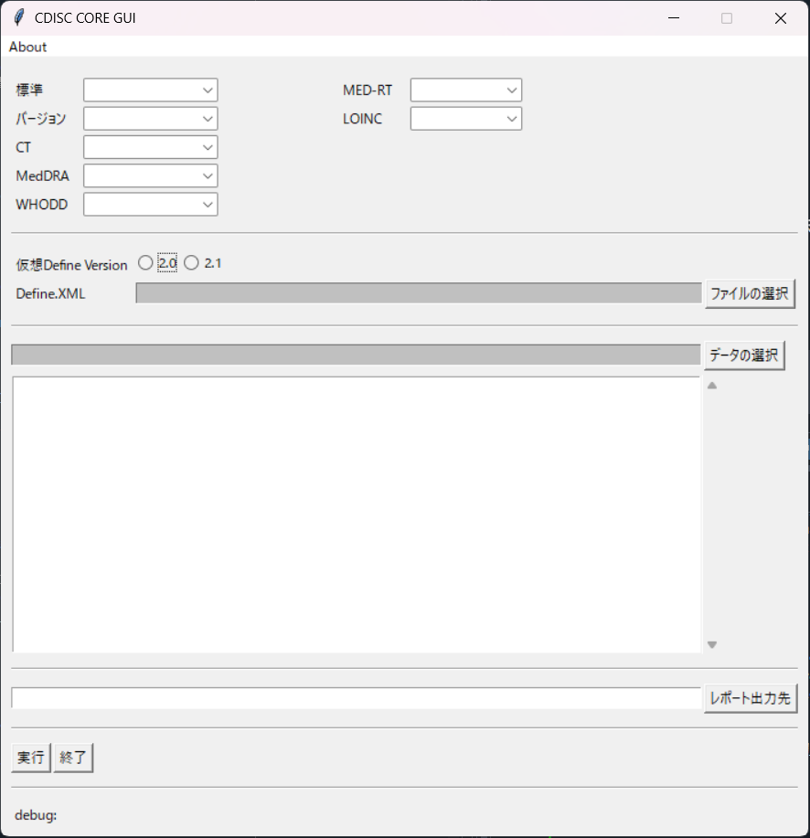

# CDISC-CORE-GUI

## 概要
CDISCはCDISC Open Rules Engine (CORE)を開発していますが、コマンドライン版のみが提供されています。CDISC CORE GUI は、COREにGUIを搭載したものです。本ツールは、ユーザーがテストしやすいCOREを用意し、CORE開発者へのフィードバックを促すことを目的としています。

## 説明

## How to Use
Following image is GUI of this tool. To validate data package...
1. Specify all required parameters.
2. Press 'Run' button.

### Configuration
Basic Settings\
-Standard: Specify Implematation Guide. All standards supported by CORE show up.\
-Version: Specify version of Standard.\
-CT: Specify version of controlled terminology. Terminology should be placed in 'resources/cache' folder.\
\
External Dictionaries\
-MedDRA: Optional. Specify version.\
-WHODD: Optional. Specify version.\
-MED-RT: Optional. Specify version.\
-LOINC: Optional. Specify version.\
\
Define.xml\
-Either 'path of define.xml' or 'expected version of define.xml' must be specified. 'Expcted version' is ignored when both parameters are specified.\
-define.xml v1.0 is not supported\
\
Data files\
-Specify dataset file(s). XPT, JSON, Parquet, USDM are acceptable file formats.\
\
Output\
-Specify report folder. '/report' is recommended.

## How to prepare external dictionaries
-Under preparation.
