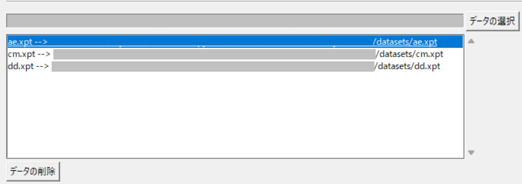

# CDISC-CORE-GUI

日本語ページはこちら [README-ja.md](https://github.com/HajimeShimizu/CDISC-CORE-GUI/blob/main/README-ja.md).

## Overview
CDISC is developing [CDISC Open Rules Engine (CORE)](https://github.com/cdisc-org/cdisc-rules-engine), but only the command line interface is provided to end users. CDISC CORE GUI provides Graphical User Interface to CORE Engine. The purpose is to enhance contribution of CDISC community to CORE project and to promote the development of PMDA regulatory rules implementation by providing easy-to-test environment.

Current version of CDISC-CORE-GUI is built upon CORE v0.10.0.

## Download
Files for download package above is found at [this page](https://github.com/HajimeShimizu/CDISC-CORE-GUI/releases)\

Download package is a composite of several products.
1. CDISC-CORE-GUI
2. Cache files that are provided by [CDISC Open Rules Engine](https://github.com/cdisc-org/cdisc-rules-engine)
3. [Rule Browser](https://github.com/HajimeShimizu/CDISC-CORE-Rule-Browser)

### Note
1. Download all files listed above.
2. Files are auto-merged by kicking exe file.
3. Unzip file.

## How to Use
Double click 'core_gui.exe'. Wait for a while, as it may take some time to boot (40 seconds is reported by test users). When you validate huge package (more than 1 GB), place the files at local drive is recommended.

At first, select language.

Following image is GUI of this tool. To validate data package...
1. Specify all required parameters.
2. Press 'Validate' button.

### Configuration
Basic Settings
- Standard: Specify Implematation Guide. All standards supported by CORE show up.
- Version: Specify version of Standard.
- CT: Specify version of controlled terminology.

External Dictionaries
- MedDRA: Optional. Specify version.
- WHODD: Optional. Specify version.
- MED-RT: Optional. Specify version.
- LOINC: Optional. Specify version.
- UNII: Optional. Specify version.
- SNOMED : Not available as Japan is not in territories of SNOMED. (But SNOMED option is implemented as part of CORE)

Define.xml
- Either 'path of define.xml' or 'expected version of define.xml' must be specified.
- When define.xml is not available for validation, please tick 2.0/2.1.
- Tick when validate define.xml as standalone (But it seems unavailable in CORE v0.9.3)

Data files
- Specify dataset file(s). XPT, JSON, Parquet, USDM are acceptable file formats.
- XLSX file that follows specified format is accepted.
- Files can be added/deleted:
  - Addtion： Select files from 'Data Selection' button.
  - Deletion： Select files to delete, then press 'Clear data' button.
  - 
Output
- Specify report folder. '/report' is recommended.

Log
- Specify log level. Default value is "Critical". Default setting is highly recommended.
- Valid options are Critical/Error/Warn/Info/Debug.
- Gigantic amount of logs are provided in Debug mode.

## How to prepare external dictionaries
### MedDRA
Store data files under 'config/meddra' folder. Create sub folders for each versions. Mandatory files are as follows: 
- pt.asc
- hlt.asc
- llt.asc
- soc.asc
- hlgt.asc
- soc_hlgt.asc
- hlgt_hlt.asc
- hlt_pt.asc
- meddra_release.asc

### WHODD
Store data files under 'config/who' folder. Create sub folders for each versions. Mandatory files are as follows: 
- DD.txt
- INA.txt
- DDA.txt
- version.txt [*]

[*]: 'Version.txt' is provided by UMC. Need to change file name. 

### MEDRT
Store data files under 'config/medrt' folder. Create sub folders for each versions. Mandatory file is core DTS file: Core_MEDRT_[yyyymmdd]_DTS.xml

### LOINC
Store data files under 'config/loinc' folder. Create sub folders for each versions. Mandatory file is Loinc.csv

### UNII
Store data files under 'config/unii' folder. Create sub folders for each versions. Mandatory file is UNII_Records_[ddMmmyyyy].txt
